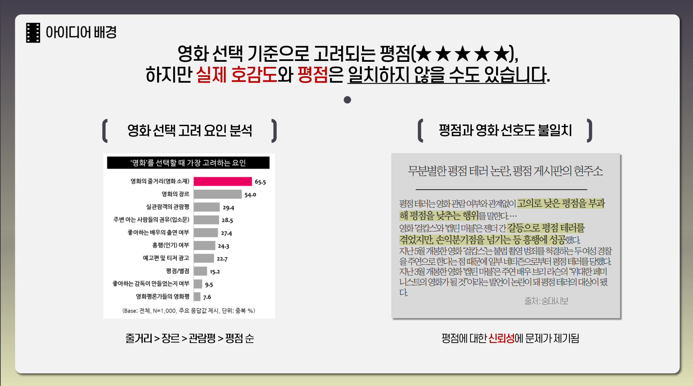
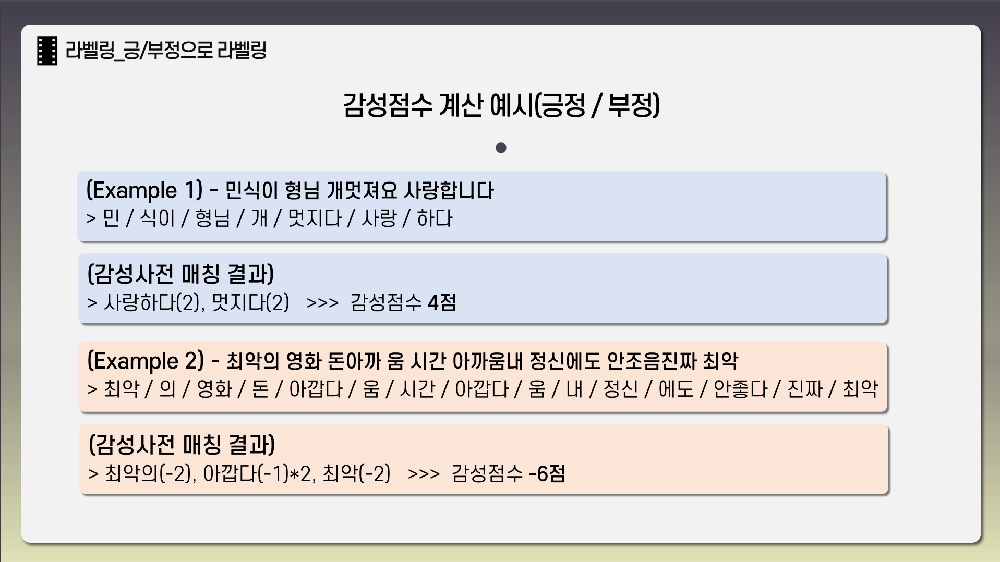
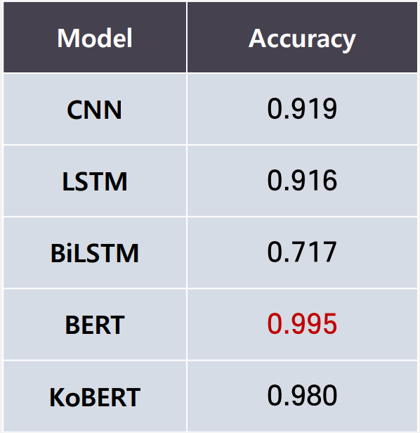
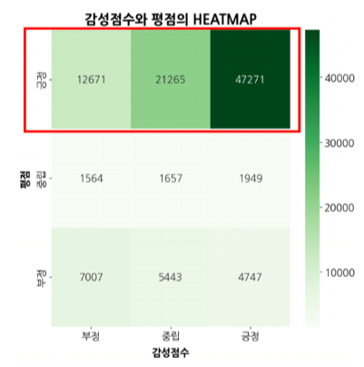

# 영화 리뷰 감성 분석
📢 세미 프로젝트로 4개 조 중 1등을 수상하였습니다.

 

# 🎯 프로젝트 요약
감성 사전을 이용한 실제 영화 리뷰의 긍/부정 분석 프로젝트   

1️⃣ **작업 기간** : 2022.12.14 ~ 2022.12.27   

2️⃣ **팀원 소개** 

<table>
    <tr>
        <td><b>김나래🤠</b></td>
        <td>데이터 수집, BERT/KoBERT 학습</td>
    </tr>
    <tr>
        <td><b>박서희</b></td>
        <td>데이터 수집, 데이티 전처리, 데이터 시각화</td>
    </tr>
    <tr>
        <td><b>박채린</b></td>
        <td>데이터 수집, 데이터 탐색 및 통합</td>
    </tr>
    <tr>
        <td><b>박호준</b></td>
        <td>데이터 수집, CNN/LSTM/Bi-LSTM 학습</td>
    </tr>
</table>

3️⃣ **사용 모델**: `LSTM`, `Bi-LSTM`, `BERT`, `KoBERT`   

4️⃣ **사용 라이브러리**: `Selenium`, `KoNLPy`, `Soynlp`, `Py-hanspell`, `PyKoSpacing`

 

# 📔 프로젝트 소개
## 1. 프로젝트 배경
* **영화관에서 영화를 선택하는 요인은 무엇일까?**    
    ➡️ 영화 선택 요인 설문조사 결과 ‘줄거리 > 장르 > **관람평** > ... > 평점’ 순 

* **영화 별점(★★★★★)이 실제 영화의 선호도를 잘 반영할까?**    
    ➡️ 영화 관람의 여부 없이 논란으로 인해 악의적으로 평점을 낮추는 ‘평점 테러’ 사례 발생 
    (ex. 걸캅스, 젠더 간 갈등으로 인한 평점 테러가 발생했으나 손익분기점 넘기고 흥행에 성공)

    

### ***영화 리뷰에 대한 긍/부정 분석으로 영화의 선호도를 한 눈에 파악할 수 있게 하는 것이 어떨까?***

 

## 2. 프로젝트 목표
* 영화 리뷰의 긍/부정 분류를 통해 기존의 영화 평점의 신뢰성 파악
* 영화 리뷰의 긍/부정 분류를 통해 제공할 수 있는 서비스 탐색

 

## 3. 프로젝트 과정
### 1️⃣ 데이터 수집

- 영화관입장권 통합전산망(KOBIS)의 ‘역대 박스오피스 TOP100 영화’ 추출
- NAVER, DAUM, WATCHAPEDIA 사이트의 리뷰를 각 영화당 500개씩 Selenium으로 크롤링
- **❗이슈1❗ 제작연도와 개봉연도**   
    **: 영화 제목 검색 시 사이트마다 제작연도와 개봉연도가 혼동되어 검색되지 않는 문제 발생**   
    **➡️ 대조 작업 후 문제의 부분을 수기로 수정하여 진행**
    

### 2️⃣ 형태소 분석(Okt + Soynlp)

- Okt 형태소 분석기를 통한 형태소 분석 + Soynlp를 통한 신조어 추출
- **❗이슈2❗ 맞춤법, 띄어쓰기, 변칙어, 신조어 문제**
    - **가볍게 쓰는 리뷰의 특성 상 기존의 문법을 무시하는 리뷰가 다수 발생**
    - **제대로 형태소 분석이 되지 않는 문제가 발생** 

    **➡️ Py-hanspell(맞춤법), PyKoSpacing(띄어쓰기)를 통해 문장의 완성도를 높인 후 진행**   
    **➡️ soynlp를 통해 신조어를 추출하고 Okt 사전에 등록하여 신조어 문제를 해결**

### 3️⃣ 감성점수 계산
- KNU 감성사전을 통한 감성 점수 계산
(긍정: 감성점수 > 0 | 중립 : 감성점수 = 0 | 부정: 감성점수 < 0)
- **❗이슈3❗ 감성사전과 영화의 긍/부정 요소 혼동**   
    **: 범죄, 살인, 눈물 등 영화의 줄거리와 관련된 키워드가 감성점수에 포함되는 경우가 발생**   
    **➡️ 수작업으로 줄거리와 연관성이 높은 단어를 감성 사전에서 제외(ex. 슬프다)**

    

### 4️⃣ 모델 학습(CNN, LSTM, Bi-LSTM, BERT, KoBERT)
- **Accuracy 기준** : BERT > KoBERT > CNN > LSTM > Bi-LSTM
- Transformer 이후의 모델이 더 우수함을 확인
- 시간 비용적인 측면에서는 KoBERT가 BERT보다 우수함을 확인

    &nbsp;&nbsp;&nbsp;
    

 

## 4. 프로젝트 결과

### 1️⃣ 영화 평점과 별점의 관계 분석
- 평점이 긍정이지만 감성 점수에서 부정 / 중립인 건수가 많은 것으로 확인되었다.    
    ➡️ **실제 느낀 것보다 평점을 더 후하게 준다고 해석할 수 있다.**

    

### 2️⃣ 서비스 연결

- 긍/부정 분석을 통해 고객의 실제 영화에 대한 긍/부정 정도를 파악하여 정확한 추천 시스템을 연결할 수 있다.
- 선호도가 비슷한 고객들을 그룹으로 묶어 각 그룹마다 맞춤형 마케팅 전략을 수립할 수 있다.
- 고객의 선호도에 맞는 새로운 영화를 효율적으로 선택할 수 있다.

### 3️⃣ 프로젝트의 한계
* ‘영화’라는 도메인에 다양한 줄거리가 있기 때문에 부정적인 줄거리와 부정적인 평을 구분하는 데 있어 추가적인 분석이 필요하다.
* 긍/부정이 모두 담긴 문장의 경우 긍정과 분류 이진으로 분류하기에는 한계가 있다. 점수화 또는 다중 분류를 통해 세분화시킬 필요가 있다.

 

# 📝 참고자료
* 장연지, 최지선 and 김한샘. (2022). 감정 어휘 사전을 활용한 KcBERT 기반 영화 리뷰 말뭉치 감정 분석. 정보과학회논문지, 49(8), 608-616.
* 조정태 and 최상현. (2015). 영화리뷰 감성 분석을 통한 평점 예측 연구. 경영과 정보연구, 34(3), 161-177.
* 김지현, 하희정, 김서희 and 정영욱. (2021) OTT 서비스 콘텐츠 추천 사용자 경험 분석 - 넷플릭스 사례를 중심으로. Journal Integrated Design Research. 20(2), 73-87.
* Soynlp, [https://github.com/lovit/soynlp]{https://github.com/lovit/soynlp}
* KNU 한국어 감성사전, [https://github.com/park1200656/KnuSentiLex](https://github.com/park1200656/KnuSentiLex)
* 딥러닝을 이용한 자연어 입문, [https://wikidocs.net/92961](https://wikidocs.net/92961)
* BERT 실습, [https://github.com/deepseasw/bert-naver-movie-review/blob/master/bert_naver_movie.ipynb](https://github.com/deepseasw/bert-naver-movie-review/blob/master/bert_naver_movie.ipynb)
* KoBERT 실습, [https://github.com/SKTBrain/KoBERT/blob/master/scripts/NSMC/naver_review_classifications_pytorch_kobert.ipynb](https://github.com/SKTBrain/KoBERT/blob/master/scripts/NSMC/naver_review_classifications_pytorch_kobert.ipynb)